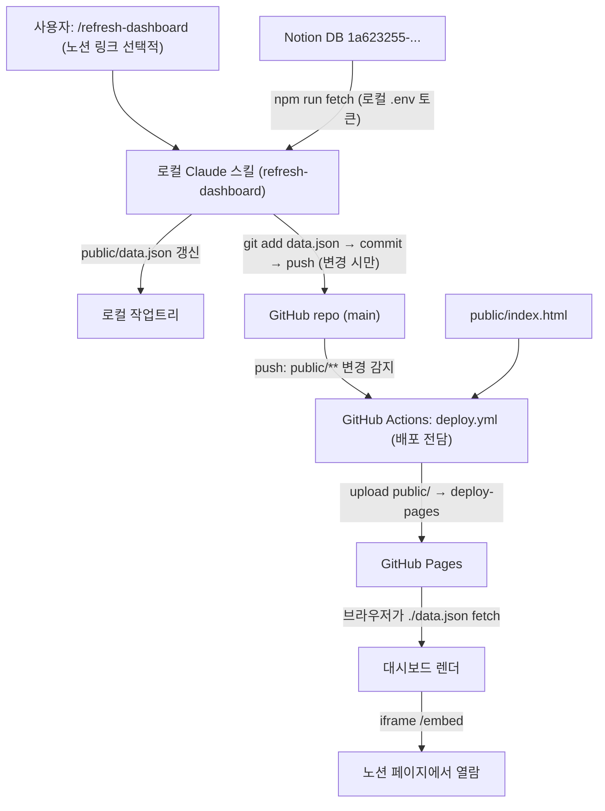

# feat: work-visualization 패스키 일정 대시보드 (타임라인 중심)

> **구현 노트 (2026-05-27):** 구현 중 설계가 진화했다. (1) 데이터 갱신을 서버측 `fetch.js`/`NOTION_TOKEN` 대신 **로컬 Claude 노션 MCP 방식**으로 단순화(`scripts/fetch.js`·`.env.example`·`@notionhq/client` 제거), (2) 대시보드를 **`/passkeys/` 경로**로 배치(루트는 안내 페이지), (3) KPI "지연 작업" 카드 클릭 시 지연 목록 표시 추가. 아래 본문은 최초 계획 기록이며, **현재 동작 기준은 `README.md`**다.

## Summary

노션 "패스키 일정 캘린더" DB의 작업 현황을, GitHub Pages에 호스팅하는 정적 HTML 대시보드로 시각화한다. 시각화는 **타임라인 중심(방향 B)** — KPI 카드 + Gantt 타임라인(메인) + 트랙별 진행률 막대 + Kanban 파이프라인 4종이며, 진척률은 작업 기간을 무게로 쓰는 **기간 가중(duration-weighted)** 방식으로 계산한다. 차트 라이브러리 없이 순수 HTML/CSS/vanilla JS로 구현한다.

데이터 갱신은 **로컬 Claude Code 스킬**이 담당한다: 노션에서 데이터를 가져와 `public/data.json`을 갱신하고 그 파일만 git commit·push 한다. **GitHub Actions는 배포 전담** — `public/**` 변경이 push되면 Pages를 재배포한다(노션 fetch는 하지 않음). 노션 토큰은 로컬 `.env`에만 두므로 GitHub Secret이 필요 없고, 봇이 data.json을 커밋하지 않아 워크플로 재트리거 루프도 없다.

---

## Problem Frame

작업 일정과 진행 현황이 노션 DB에만 있어, "지금 일정대로 가고 있나 / 뭐가 남았나 / 어디가 막혔나"를 한눈에 보기 어렵다. 노션 기본 뷰는 이 질문들에 즉답하지 못한다. 배포된 대시보드 URL을 노션 페이지에 `/embed`(다른 페이지 안에 외부 웹페이지를 끼워 넣는 노션 블록)로 붙여, 노션 안에서 현황판을 보는 것이 최종 사용 시나리오다.

이 계획은 사용자와의 사전 논의로 다음이 확정된 상태에서 출발한다.
- 시각화 방향: **방향 B(타임라인 중심)** — 원안 5종 중 Burnup·Calendar Heatmap 제외, Gantt 신규 추가.
- 진척률 계산: **기간 가중** — 작업마다 무게감이 다른 문제를 반영.
- 갱신 구조: **로컬 스킬이 fetch+commit+push, CI는 배포 전담** — 사용자가 명령하면 로컬에서 data.json을 갱신·푸시하고, push가 GitHub Actions 배포를 트리거한다.

---

## Requirements

- R1. 노션 DB(ID `1a623255-da14-4636-a230-5eb1d7a8b22e`)의 작업을 정규화해 `public/data.json`으로 저장한다. (페이지네이션, 한글 컬럼, status 타입 처리 포함)
- R2. 대시보드는 정적 파일만으로 동작한다 — 브라우저는 외부 API를 직접 호출하지 않고 반드시 `./data.json`만 읽는다.
- R3. KPI 카드 4종을 표시한다: 기간 가중 작업 진척률 / 시간 진척률 / 잔여 일수(D-day) / 지연 작업 수.
- R4. 작업 진척률은 **기간 가중**으로 계산한다: 완료 작업들의 일수 합 ÷ 전체 작업들의 일수 합.
- R5. Gantt 타임라인을 메인 위젯으로 표시한다: 트랙별 레인 + 작업 막대(시작~종료) + 상태별 색 + 오늘선.
- R6. 트랙별 진행률 막대(완료/진행/대기 3색 + 실제 개수)와 Kanban 파이프라인(종류별 단계 + 단계 내 상태 분포)을 표시한다.
- R7. 색 의미를 전 위젯에서 일관 유지한다: 완료=초록 `#3B6D11`, 진행 중=파랑 `#378ADD`, 대기=회색 `var(--color-background-tertiary)`. 색만으로 구분하지 않고 텍스트/개수를 병행한다.
- R8. 라이트/다크 모드 둘 다 지원한다 (`prefers-color-scheme` CSS 변수 기반).
- R9. 헤더에 마지막 갱신 시각을 한국 시간(`Asia/Seoul`) `YYYY-MM-DD HH:mm`으로 표시한다.
- R10. `data.json` 로드 실패 시 에러 상태 UI + 재시도 버튼을 표시한다.
- R11. **로컬 Claude Code 스킬**(`refresh-dashboard`)이 노션 데이터를 가져와 `public/data.json`을 갱신하고, **data.json만** git commit·push 한다. 변경이 없으면 커밋하지 않는다. (선택적으로 노션 링크를 받아 대상 DB를 지정)
- R12. **GitHub Actions는 배포 전담**이다 — main에 `public/**` 변경이 push되거나 수동 실행(workflow_dispatch) 시 Pages를 재배포한다. CI는 노션 fetch를 하지 않는다.
- R13. `NOTION_TOKEN`은 로컬 `.env`에만 두며(gitignore 대상), 커밋 파일·`data.json`·README·예시 출력·로그 어디에도 노출되지 않는다. CI는 토큰을 필요로 하지 않는다.

---

## Scope Boundaries

- 자동/주기적 데이터 갱신은 하지 않는다 — 갱신은 사용자가 스킬을 호출할 때만 일어나는 수동 트리거다. (노션은 변경을 외부에 자동 통보하지 않음)
- 대시보드에서 노션 데이터를 편집하는 기능은 없다 (읽기 전용 시각화).
- 인증/접근 제어는 두지 않는다 — Pages 공개 URL 전제.
- 여러 프로젝트 대시보드를 동시에 두지 않는다 — 이번 라운드는 패스키 대시보드 하나만 루트에 둔다.
- 자동화 테스트 하네스(jest/vitest 등)는 도입하지 않는다 — 기존 테스트가 없고 프로젝트 컨벤션상 요청 없이 테스트를 추가하지 않는다. 검증은 각 유닛의 수동 검증 시나리오로 수행한다.

### Deferred to Follow-Up Work

- **서버측(GitHub Actions) fetch**: 현재는 로컬 스킬이 fetch를 담당한다. 로컬 머신·토큰 없이 원격에서 갱신해야 할 필요가 생기면, Actions에 fetch 잡과 GitHub Secret(`NOTION_TOKEN`)을 추가하는 방식으로 확장한다. (단 로컬·서버 양쪽이 data.json을 커밋하면 충돌 위험이 있으므로 한쪽을 canonical로 유지)
- Burnup 차트 / Calendar Heatmap: 작업 수가 충분히 커지면 재검토. 현재 ~18개 규모에서는 효용이 낮아 제외 (근거: `.contexts/dashboard-design-research-2026-05-27.md`).
- 명시적 가중치 컬럼(공수/스토리포인트) 기반 진척률: 기간 가중이 부정확하게 느껴질 때 노션에 가중치 컬럼을 추가하는 방식으로 전환.
- 향후 다른 프로젝트 대시보드 추가 (리포 이름 `work-visualization`은 이를 염두에 둔 일반명).

---

## Context & Research

### Relevant Code and Patterns

- 신규(greenfield) 리포 — 따라야 할 기존 코드 없음. 디자인 토큰(CSS 변수 `--color-*`, `--font-*`, `--border-radius-*`)과 색 의미는 원안 프롬프트에 명시된 값을 그대로 사용한다.
- 원안에서 첨부 예정이던 `dashboard_base.html`은 **사용하지 않는다**. 그 파일이 담고 있던 위젯 구성(KPI/Burnup/진행률/Kanban/Heatmap, Gantt 없음)과 방향 B의 구성(KPI/Gantt/진행률/Kanban)이 크게 달라, 변환보다 새로 구성하는 편이 깔끔하다. 디자인 토큰만 재사용한다.

### Institutional Learnings

- 해당 없음 (신규 리포, `docs/solutions/` 미적용).

### External References

- 일정 시각화 기법 효과성 & 임베드 대시보드 구성 리서치: `.contexts/dashboard-design-research-2026-05-27.md`
  - 핵심: ~18개 규모 날짜 범위 데이터에는 **Gantt가 가장 강력**. CFD/Heatmap/Burndown은 이 규모에서 데이터 대비 시각 복잡도 과잉. 위젯은 4~6개가 적정. 색만으로 의존 금지(색+텍스트 병행), 다크모드는 surface 계층 유지.
- 지표 설명서(사용자 학습용): `.contexts/dashboard-metrics-explained-2026-05-27.md`
- Claude Code 스킬 구조: `.claude/skills/<name>/SKILL.md` (frontmatter `name`/`description` + 절차 본문). 사용자가 `/refresh-dashboard` 호출 시 Claude가 절차를 실행.

---

## Key Technical Decisions

- **갱신은 로컬 스킬, 배포는 CI (역할 분리)**: 데이터 fetch+commit+push는 로컬 Claude 스킬이, Pages 배포는 GitHub Actions가 전담한다. 이점: (1)노션 토큰이 로컬 `.env`에만 있어 GitHub Secret 불필요, (2)봇이 data.json을 커밋하지 않으므로 워크플로 재트리거 루프가 원천적으로 없음, (3)fetch 로직이 한 곳(fetch.js, 로컬 실행)에만 존재. 따라서 deploy 워크플로는 `public/**` push에 트리거된다(원안과 달리 data.json push가 배포를 일으키는 게 의도된 동작).
- **스킬은 data.json만 스테이징**: `git add public/data.json`만 수행해, 작업트리의 무관한 변경이 함께 커밋되지 않게 한다. push가 remote보다 뒤처져 거부되면 `git pull --rebase` 후 재시도.
- **Chart.js 미사용, 순수 HTML/CSS/vanilla JS**: 방향 B에서 유일한 "진짜 차트"였던 Burnup이 빠졌다. 남은 4개 위젯은 모두 `div` 기반으로 그릴 수 있어 외부 CDN 의존이 불필요하다. 노션 iframe에서 로드가 가볍고 다크모드/오늘선/반응형을 CSS로 완전히 제어한다.
- **진척률 = 기간 가중(duration-weighted)**: 작업 진척률 = (완료 작업들의 일수 합) ÷ (전체 작업들의 일수 합). 작업 기간 = `end - start + 1`(양 끝 포함), 최소 1일. 보유한 시작/종료일만 사용(노션 컬럼 추가 없음). 진행 중은 진척률에서 0(미완료)으로 계산하고, 진행 상태는 Gantt/막대 색으로 별도 표현.
- **트랙별 진행률 막대는 개수 기준 유지**: 세그먼트는 트랙 내 상태별 작업 개수로 채우고 "완료 2/진행 1/대기 2" 실제 개수를 병기. 헤드라인 진척률(기간 가중)과 목적이 달라(트랙 간 빠른 비교) 개수 기준이 직관적.
- **Gantt는 CSS 그리드/절대배치로 구현**: 가로축 = 날짜(일 단위), 트랙을 레인으로 그룹화, 작업은 시작~종료 막대. 오늘선은 위치 계산된 세로 요소. `TODAY`가 범위 밖이면 가장자리에 클램프.
- **날짜는 UTC 기준 정수 offset**: 날짜 문자열을 UTC 자정으로 파싱(타임존 드리프트 방지). `START` = 가장 빠른 시작일을 그 주 월요일로 보정, `TOTAL_DAYS` = 가장 늦은 종료일까지 차이 + 1, `TODAY` = `floor((now - START)/86400000)`.
- **검증은 수동 시나리오 기반**: 자동 테스트 하네스 미도입(프로젝트 컨벤션). 각 유닛에 구체적 입력→기대 결과 시나리오.

---

## Open Questions

### Resolved During Planning

- 시각화 방향: 방향 B(타임라인 중심) 확정 (사용자 선택).
- 진척률 계산: 기간 가중 확정 (사용자 선택).
- KPI 4종: 기간 가중 작업 진척률 / 시간 진척률 / 잔여 일수 / 지연 작업 수 (추천안 적용, 조정 가능).
- Chart.js: 미사용 확정.
- 갱신 구조: 로컬 스킬 fetch+commit+push + CI 배포 전담 확정 (사용자 선택). 서버측 fetch는 deferred.

### Deferred to Implementation

- 한 트랙에 겹치는 작업이 많을 때 Gantt 행 쌓기(stacking)의 구체 레이아웃 — 실제 데이터 겹침 정도 보고 결정.
- 종류(type)가 null인 작업의 Kanban 분류 — 실데이터 확인 후 "기타" 묶음/제외 결정.
- 노션 링크에서 DB ID 추출 형식 — 실제 공유 URL 형태(`.../<32hex>?v=...`) 확인 후 파싱 규칙 확정.
- `START`를 월요일로 보정했을 때 Gantt 좌측 여백 처리 — 렌더 후 시각 확인하며 조정.

---

## Output Structure

    work-visualization/
    ├── .claude/
    │   └── skills/
    │       └── refresh-dashboard/
    │           └── SKILL.md        # 로컬 갱신 스킬 (fetch → data.json → commit/push)
    ├── .github/
    │   └── workflows/
    │       └── deploy.yml          # GitHub Actions: 배포 전담 (public/** push 시 Pages 재배포)
    ├── scripts/
    │   └── fetch.js                # Notion API 호출 → public/data.json 저장 (로컬 실행)
    ├── public/
    │   ├── index.html              # 대시보드 본체 (KPI·Gantt·진행률·Kanban)
    │   └── data.json               # fetch.js 생성물 (커밋됨, gitignore 금지)
    ├── docs/
    │   └── plans/                  # 이 계획 문서
    ├── .gitignore
    ├── package.json
    ├── README.md                   # 셋업 가이드
    └── .env.example

---

## High-Level Technical Design

> 이 다이어그램은 의도한 데이터 흐름을 보여주는 방향성 가이드이며, 구현 명세가 아니다. 구현 에이전트는 맥락으로만 참고한다.



데이터 스키마 (`public/data.json`):

```json
{
  "generated_at": "2026-05-27T12:00:00Z",
  "database_id": "1a623255-...",
  "tasks": [
    { "id": "page_id", "title": "operation-api 진행 (PR까지)",
      "track": "관리자", "type": "개발", "status": "In progress",
      "start": "2026-05-27", "end": "2026-05-28" }
  ]
}
```

---

## Implementation Units

### U1. 프로젝트 골격 및 설정 파일

**Goal:** npm 프로젝트 초기화와 기본 설정 파일을 만들어 이후 작업의 토대를 마련한다.

**Requirements:** R2, R13

**Dependencies:** None

**Files:**
- Create: `package.json` (`"type": "module"`, scripts: `fetch`, `dev`)
- Create: `.gitignore`
- Create: `.env.example`
- Create: `public/` 디렉토리

**Approach:**
- `package.json`: `dependencies`에 `@notionhq/client`, `dotenv`; `devDependencies`에 `http-server`. scripts `"fetch": "node scripts/fetch.js"`, `"dev": "http-server public -p 8080 -c-1"`.
- `.gitignore`: `node_modules/`, `.env`, `.env.local`, `.DS_Store`, `*.log`. **`public/data.json`은 절대 포함하지 않는다.**
- `.env.example`: `NOTION_TOKEN=secret_xxxxxxxxxxxxx`, `NOTION_DATABASE_ID=1a623255da144636a2305eb1d7a8b22e` (실제 토큰 값은 넣지 않음).

**Patterns to follow:**
- 표준 Node ESM 프로젝트 레이아웃 (신규이므로 컨벤션 신설).

**Test scenarios:**
- Test expectation: none -- 설정 파일만 생성, 동작 로직 없음.

**Verification:**
- `npm install`이 에러 없이 완료된다.
- `.gitignore`에 `public/data.json`이 없고 `.env`가 있다.
- 로컬에서 `.env` 생성 후 `git status`에서 `.env`가 추적 대상이 아니다.

---

### U2. scripts/fetch.js — Notion 데이터 수집 (로컬 실행)

**Goal:** 노션 DB를 query해 정규화된 작업 목록을 `public/data.json`으로 저장한다. 로컬에서 스킬이 호출한다.

**Requirements:** R1, R13

**Dependencies:** U1

**Files:**
- Create: `scripts/fetch.js`

**Approach:**
- 환경변수 `NOTION_TOKEN`, `NOTION_DATABASE_ID` 사용. 로컬 `.env`를 `dotenv`로 로드(있으면). `NOTION_DATABASE_ID`는 스킬이 노션 링크를 줄 경우 그 값으로 override될 수 있다(기본값은 설정된 DB ID).
- `@notionhq/client`의 `databases.query` 호출, `has_more`/`next_cursor`로 페이지네이션 전체 수집.
- 각 row 정규화 (한글 키는 bracket notation):
  - `properties['제목'].title[0]?.plain_text` → `title` (없으면 빈 문자열)
  - `properties['트랙'].select?.name` → `track`
  - `properties['종류'].select?.name ?? null` → `type`
  - `properties['status'].status?.name` → `status` (status 타입, select와 다름)
  - `properties['일자'].date?.start` → `start`, `properties['일자'].date?.end ?? start` → `end`
- `tasks`를 `start` 오름차순 정렬.
- 출력: `{ generated_at, database_id, tasks }` → `public/data.json`.
- 에러 처리: API 실패/필수 env 누락 시 `console.error` 후 `process.exit(1)`.
- 성공 시: fetch된 task 수와 출력 경로를 `console.log`. **토큰을 로그/출력/data.json에 절대 포함하지 않는다.**

**Patterns to follow:**
- Notion SDK 표준 페이지네이션 루프 (`while (hasMore)`).

**Test scenarios:**
- Happy path: 유효한 토큰/DB로 `npm run fetch` → `public/data.json` 생성, task 약 18개, 각 task에 title/track/type/status/start/end.
- Edge: `종류` 비어있음 → `type`이 `null`로 저장되고 죽지 않음.
- Edge: `일자.end` 없음 → `end`가 `start`와 동일.
- Edge: row 100개 초과(페이지네이션) → 전체 수집(현재 단일 페이지, 코드 경로만 확인).
- Error path: `NOTION_TOKEN` 미설정 → stderr 에러 + exit 1 (`echo $?` 확인).
- Error path: 잘못된 DB ID → 401/404 stderr + exit 1.

**Verification:**
- 생성된 `data.json`에 토큰 문자열이 없음을 확인.
- `tasks`가 `start` 오름차순.

---

### U3. public/index.html 기반 — 스캐폴딩·토큰·데이터 로딩·transformTasks·에러/갱신

**Goal:** 정적 HTML 골격, 디자인 토큰, 데이터 로딩/에러 상태, 날짜 변환 유틸, 마지막 갱신 표시까지 공통 토대를 만든다.

**Requirements:** R2, R7, R8, R9, R10

**Dependencies:** U1 (스키마는 U2 참조)

**Files:**
- Create: `public/index.html`

**Approach:**
- `<!DOCTYPE html><html lang="ko">` 스캐폴딩, `<head>`에 charset/viewport/title.
- `:root` CSS 변수(원안 명시값) + `@media (prefers-color-scheme: dark)` 다크 오버라이드. `body { margin:0; padding:24px; background: var(--color-background-primary) }`, `.container { max-width:1100px; margin:0 auto }`.
- 헤더: `<h1>패스키 일정 대시보드</h1>` + 우측 `마지막 갱신: <span id="updated-at">…</span>`.
- `#dash-root` + 위젯 자리 `id`: `kpi`, `gantt`, `tprog`, `pipe`.
- `async function init()`: `fetch('./data.json', { cache:'no-store' })` → 실패 시 `#dash-root`에 에러 상태 + `재시도` 버튼. 성공 시 `transformTasks` → 각 `render*` 호출.
- `transformTasks(tasks)`: 날짜 UTC 파싱, `START`(최빠 시작일→해당 주 월요일 보정), `TOTAL_DAYS`, 각 task에 `startOffset`/`endOffset`/`durationDays`(`end-start+1`, 최소 1) 부여, `TODAY` offset. `{START, TOTAL_DAYS, TODAY, tasks}` 반환.
- `renderLastUpdated(iso)`: ISO → `Asia/Seoul` `YYYY-MM-DD HH:mm` (`Intl.DateTimeFormat('ko-KR', { timeZone:'Asia/Seoul', ...})`).

**Technical design:** *(방향성 가이드)*
- `transformTasks` 반환: `{ START, TOTAL_DAYS, TODAY, tasks:[{...원본, startOffset, endOffset, durationDays}] }`. 위젯 함수는 이 객체를 받아 렌더.

**Patterns to follow:**
- 위젯 렌더 함수는 `(model) => void` 형태로 분리.

**Test scenarios:**
- Happy path: 정상 `data.json` → 헤더에 한국 시간 표시, 위젯 컨테이너가 채워짐.
- Edge: `TODAY`가 범위 이전/이후 → 예외 없이 진행(클램프는 위젯에서).
- Edge: 작업 0개 → 빈 상태로 안 깨짐.
- Error path: `data.json` 404/깨진 JSON → 에러 상태 + 재시도 버튼.

**Verification:**
- `npm run dev` 후 `http://localhost:8080`에서 헤더 갱신 시각이 한국 시간으로 보임.
- 임시로 `data.json` 이름 변경해 404 유발 → 에러+재시도 확인 후 원복.

---

### U4. KPI 카드 (기간 가중)

**Goal:** 상단 KPI 카드 4종 — 기간 가중 작업 진척률 / 시간 진척률 / 잔여 일수 / 지연 작업 수.

**Requirements:** R3, R4, R7

**Dependencies:** U3

**Files:**
- Modify: `public/index.html` (`renderKPI(model)`, `#kpi`)

**Approach:**
- **기간 가중 진척률** = `sum(durationDays where status==='Done') / sum(durationDays all) * 100`, 반올림. 분모 0이면 0%.
- **시간 진척률** = `clamp(TODAY / (TOTAL_DAYS - 1), 0, 1) * 100`, 반올림.
- **잔여 일수** = `(마지막 종료일 offset) - TODAY`. 0 이상 `D-n`, 음수 `마감 +n일 지남`.
- **지연 작업 수** = `count(endOffset < TODAY && status !== 'Done')`.
- 진척률·시간 진척률 카드를 인접 배치(비교 강조). 지연 0이면 중립색, 1+이면 경고색 + "지연" 텍스트 병행(색 단독 의존 금지).

**Patterns to follow:**
- KPI 카드 5요소(라벨/값/맥락) — `.contexts/dashboard-design-research-2026-05-27.md`.

**Test scenarios:**
- Happy path: 완료 일수 6 / 전체 11 → 55% (검산).
- Happy path: 기간 5/1~5/30, 오늘 5/27 → 시간 진척률 ~90%, 잔여 D-3.
- Edge: 전부 완료 → 100%, 지연 0.
- Edge: 오늘이 시작 전 → 시간 진척률 0%, 잔여 = 전체 기간.
- Edge: 오늘이 마지막 종료일 이후 → 시간 진척률 100%, 잔여 "마감 +n일 지남".
- Edge: 종료일 지난 미완료 2개 → 지연 2, 경고색 + "지연" 텍스트.

**Verification:**
- 손계산 기간 가중 진척률과 카드 값 일치.
- 진척률 < 시간 진척률일 때 두 카드가 나란히 보여 "지연 위험"이 즉시 읽힘.

---

### U5. Gantt 타임라인 (메인 위젯)

**Goal:** 트랙별 레인 위에 작업 막대(시작~종료)와 오늘선을 그린 Gantt 타임라인.

**Requirements:** R5, R7, R8

**Dependencies:** U3

**Files:**
- Modify: `public/index.html` (`renderGantt(model)`, `#gantt`)

**Approach:**
- 가로축 = `START`부터 `TOTAL_DAYS`까지 일 그리드, 주 단위 구분선/날짜 라벨(월요일 기준).
- 트랙 6종을 위→아래 레인(데이터에 등장하는 트랙만, 고정 순서: 등록/인증/관리자/프론트/메트릭/마일스톤).
- 각 작업 = 레인 내 가로 막대(`left=startOffset`, `width=durationDays`), 색 = 상태. 제목 텍스트(좁으면 `title` 속성).
- 오늘선: `TODAY` 위치 세로 요소. 범위 밖이면 가장자리 클램프 + "범위 밖" 표식.
- 같은 트랙에 겹치는 작업 여럿이면 행 쌓기.
- CSS 그리드/% 절대배치, 700px에서도 가로 스크롤/축소로 대응.

**Technical design:** *(방향성 가이드)*
- `left = startOffset / TOTAL_DAYS * 100%`, `width = durationDays / TOTAL_DAYS * 100%`. 오늘선 `left = clamp(TODAY,0,TOTAL_DAYS-1)/TOTAL_DAYS * 100%`.

**Patterns to follow:**
- Gantt 권고(swimlane + today line) — `.contexts/dashboard-design-research-2026-05-27.md`.

**Test scenarios:**
- Happy path: 작업 3개(완료/진행/대기, 다른 트랙) → 올바른 위치·너비·색.
- Happy path: 오늘선이 오늘 위치에 세로 표시.
- Edge: `end==start` 1일 작업 → 최소 너비 막대 보임.
- Edge: 같은 트랙 겹치는 작업 2개 → 행 쌓여 안 겹침.
- Edge: `TODAY` 범위 밖 → 가장자리 클램프 + 표식.
- Edge: 작업 0개 트랙 → 레인 생략/빈 처리(안 깨짐).

**Verification:**
- 막대 좌/우 끝이 가로축 날짜와 정렬.
- 다크모드에서 상태 색·배경 대비 유지(회색 막대가 배경과 구분).

---

### U6. 보조 위젯 — 트랙별 진행률 막대 + Kanban 파이프라인

**Goal:** 트랙별 진행률 막대(개수 기준 3색 + 실제 개수)와 Kanban 파이프라인(종류별 단계 + 단계 내 상태 분포).

**Requirements:** R6, R7

**Dependencies:** U3

**Files:**
- Modify: `public/index.html` (`renderProgressBars(model)`, `renderKanban(model)`, `#tprog`/`#pipe`)

**Approach:**
- 진행률 막대: 트랙마다 한 줄, 완료/진행/대기 **개수** 비율 3색 스택 + "완료 2 / 진행 1 / 대기 2" 텍스트 병기.
- Kanban: 종류(개발/PR 업로드/리뷰 대기/리뷰 반영/마일스톤)를 단계로, 단계별 작업 수 + 단계 내 상태 분포. 좁은 폭에서 세로 나열 고려.
- `type` null 작업: "기타" 묶음/제외 — 실데이터 확인 후 결정(Open Questions).

**Patterns to follow:**
- 진행률 막대는 길이 기반 비교(가장 정확한 시각 속성) — 리서치 근거.

**Test scenarios:**
- Happy path: 인증 트랙 5개(완료2/진행1/대기2) → 막대 40/20/40% + 개수 텍스트.
- Happy path: '리뷰 대기' 5개 → Kanban 해당 단계 수 5.
- Edge: 작업 0개 트랙 → 빈 막대/"0건".
- Edge: `type` null → 정책대로 안 깨짐.

**Verification:**
- 막대 세그먼트 합 = 병기 개수 합.
- 전 위젯 색 의미 동일 적용.

---

### U7. GitHub Actions 워크플로 (배포 전담)

**Goal:** `public/**` 변경 push 시(또는 수동) GitHub Pages로 배포만 하는 워크플로. 노션 fetch는 하지 않는다.

**Requirements:** R12

**Dependencies:** U3 (배포할 `public/` 산출물 필요)

**Files:**
- Create: `.github/workflows/deploy.yml`

**Approach:**
- 트리거: `workflow_dispatch` + `push`(branches `main`, paths `public/**`). data.json 또는 index.html 변경 시 배포.
- permissions: `pages: write`, `id-token: write` (commit 안 하므로 `contents: write` 불필요). concurrency group `pages`, `cancel-in-progress: false`.
- 단일 job `deploy`: checkout → `actions/configure-pages` → `actions/upload-pages-artifact`(`path: public`) → `actions/deploy-pages`.
- **fetch 잡 없음, GitHub Secret 불필요** — 토큰은 로컬에만.

**Patterns to follow:**
- GitHub Pages 공식 액션 조합(configure-pages / upload-pages-artifact / deploy-pages).

**Test scenarios:**
<!-- 워크플로는 GitHub에서만 완전 검증. 동작 기대 시나리오. -->
- Happy path: 스킬이 data.json push → `public/**` 변경 감지 → deploy 성공 → Pages URL 갱신.
- Happy path: `workflow_dispatch` 수동 실행 → 현재 `public/` 재배포.
- Edge: scripts/ 만 변경 push → 배포 트리거 안 됨(서빙 산출물 아님).
- Security: 로그에 토큰이 등장하지 않음(애초에 토큰 미사용).

**Verification:**
- Actions 탭에서 deploy job 성공.
- GitHub Secret 없이도 배포가 동작(토큰 불요 확인).

---

### U8. Claude Code 스킬 — refresh-dashboard (로컬 갱신)

**Goal:** 사용자가 호출하면(선택적 노션 링크와 함께) 노션 데이터를 가져와 `public/data.json`을 갱신하고 그 파일만 commit·push 하는 로컬 스킬.

**Requirements:** R11, R13

**Dependencies:** U2 (`npm run fetch`), U7 (push가 트리거할 배포)

**Files:**
- Create: `.claude/skills/refresh-dashboard/SKILL.md`

**Approach:**
- Frontmatter: `name: refresh-dashboard`, `description`(노션 데이터 갱신→data.json→commit/push 트리거 설명).
- 절차 본문(Claude가 실행할 단계):
  1. 인자에 노션 링크/DB ID가 있으면 32자리 hex DB ID를 추출해 `NOTION_DATABASE_ID`로 사용. 없으면 `.env`/기본 DB ID.
  2. 로컬 `.env`에 `NOTION_TOKEN`이 있는지 확인. 없으면 사용자에게 `.env` 설정 안내 후 중단.
  3. `npm run fetch` 실행(필요 시 `NOTION_DATABASE_ID` override). 실패(exit 1)면 에러 보고 후 중단.
  4. `git status --porcelain public/data.json`로 변경 확인. 변경 없으면 "데이터 변경 없음" 보고 후 커밋하지 않고 종료.
  5. `git add public/data.json` (**오직 이 파일만** 스테이징).
  6. `git commit -m "chore: refresh notion data <UTC timestamp>"`.
  7. `git push`. 거부되면(remote 앞섬) `git pull --rebase` 후 재시도.
  8. 보고: 커밋/푸시 완료, CI가 곧 배포함, 노션 임베드 새로고침 안내.
- 토큰을 출력/로그에 노출하지 않는다.

**Patterns to follow:**
- 사용자 글로벌 규칙의 커밋 정책(의미 단위 커밋, 무관 파일 제외) — 스킬은 data.json만 다룬다.
- Claude Code 스킬 구조(`.claude/skills/<name>/SKILL.md`).

**Test scenarios:**
<!-- 스킬은 절차 문서. 실제 호출로 수동 검증. -->
- Happy path: 노션 1건 수정 후 스킬 호출 → data.json 변경 → data.json만 커밋 → push → Actions 배포 → 노션 임베드 새로고침 시 반영.
- Edge: 변경 없음 → "변경 없음" 보고, 커밋/푸시 안 함.
- Edge: 작업트리에 무관한 변경 존재 → 그 변경은 커밋되지 않고 data.json만 커밋.
- Edge: remote가 앞서 push 거부 → `pull --rebase` 후 성공.
- Error path: `.env`에 토큰 없음 → 안내 후 안전 중단(부분 커밋 없음).
- Error path: `npm run fetch` 실패 → 중단, 커밋 없음.

**Verification:**
- 스킬 한 번 호출로 노션 변경이 라이브 사이트까지 반영된다(end-to-end).
- 커밋에 `public/data.json` 외 파일이 포함되지 않는다.

---

### U9. README + 셋업 문서

**Goal:** 노션/깃허브 셋업, 로컬 테스트, 갱신(스킬), 노션 임베드, 트러블슈팅을 담은 README.

**Requirements:** R11, R12, R13

**Dependencies:** U1–U8 (전체 동작 문서화)

**Files:**
- Create: `README.md`

**Approach:**
- 섹션: (1)개요 (2)노션 셋업(Integration 생성→Secret 복사→DB Connections 추가) (3)로컬 셋업(`cp .env.example .env`→토큰 입력→`npm install`) (4)로컬 테스트(`npm run fetch`→`npm run dev`→localhost:8080) (5)**갱신 방법: `refresh-dashboard` 스킬 호출**(노션 수정 후 스킬 실행→data.json 커밋/푸시→CI 자동 배포) (6)깃허브 셋업(코드 push, **Settings→Pages: Source "GitHub Actions"**; CI는 배포 전담이라 Secret 불필요 명시) (7)노션 임베드(배포 URL→`/embed`) (8)트러블슈팅(401/404→Integration 권한, data.json 비어있음→DB ID/한글 컬럼, Pages 404→Pages Source 설정, push 거부→pull --rebase).
- 스크린샷 자리 `<!-- screenshot -->`.
- **`NOTION_TOKEN` 실제 값은 어떤 예시에도 넣지 않는다.** DB ID는 예시에 포함 가능.
- 개요에 방향 B 구성·기간 가중 진척률·"로컬 스킬 갱신 + CI 배포" 구조를 한 줄씩 설명.

**Patterns to follow:**
- 셋업 가이드는 명령마다 한 줄 설명(비개발자 독자 기준).

**Test scenarios:**
- Test expectation: none -- 문서.

**Verification:**
- README 절차대로 따라가면 로컬에서 `npm run dev`로 대시보드가 뜨고, 스킬 호출로 갱신·배포가 된다(절차 누락 없음).
- 토큰 값이 README 어디에도 없다.

---

## System-Wide Impact

- **Interaction graph:** 진입점은 (1)로컬 스킬(refresh: fetch→commit→push)과 (2)CI(deploy: public/** push 시 배포) 둘. `fetch.js`와 `index.html`은 `data.json` 스키마 하나로만 결합된다. 스키마 변경 시 양쪽을 함께 수정.
- **Error propagation:** fetch 실패(exit 1)면 스킬이 커밋 전 중단 → 잘못된 데이터가 푸시/배포되지 않음. 클라이언트 로드 실패는 에러 상태 UI로 격리.
- **State lifecycle risks:** 봇이 data.json을 커밋하지 않으므로(로컬만 커밋) 워크플로 재트리거 루프 없음. 로컬 push가 remote보다 뒤처지면 스킬이 `pull --rebase`로 해소.
- **API surface parity:** 외부 공개 계약은 (1)`data.json` 스키마 (2)Pages URL (3)스킬 인자(노션 링크) 형식. 이 셋의 호환성 유지.
- **Integration coverage:** 노션 수정 → 스킬 → push → 배포 → 노션 임베드 반영까지는 단위 검증으로 증명되지 않으므로 end-to-end 수동 확인 필요.
- **Unchanged invariants:** 색 의미(완료 초록/진행 파랑/대기 회색)와 디자인 토큰은 전 위젯 불변.

---

## Risks & Dependencies

| Risk | Mitigation |
|------|------------|
| 노션 한글 컬럼/`status` 타입 파싱 실수로 data.json이 비거나 깨짐 | bracket notation + status는 `.status.name`(select 아님) 명시, fetch 후 task 수/필드 검증 |
| `NOTION_TOKEN` 노출 | 토큰은 로컬 `.env`(gitignored)에만, fetch.js/스킬이 출력·커밋·로그에 미포함 — U2/U8/U9 검증 |
| 스킬이 무관한 작업트리 변경을 함께 커밋 | `git add public/data.json`만 스테이징 |
| 로컬 push가 remote보다 뒤처져 거부 | 스킬이 `git pull --rebase` 후 재시도 |
| 로컬 토큰/머신 없이는 갱신 불가 | 의도된 트레이드오프. 원격 갱신 필요 시 서버측 fetch를 Deferred로 추가 |
| Gantt가 소규모에서 여백 과다/겹침 작업 레이아웃 붕괴 | 행 쌓기 + 렌더 후 실데이터 시각 조정(Deferred to Implementation) |
| Pages 404 (Source 미설정) | README 트러블슈팅에 "Settings→Pages: GitHub Actions" 명시 |
| 기간 가중이 체감 진척과 어긋남(기간≠난이도) | 명시적 가중치 컬럼 전환을 Deferred에 명시 |

---

## Documentation / Operational Notes

- README가 운영 문서를 겸한다(셋업·갱신·트러블슈팅).
- 표준 갱신 흐름: 노션 수정 → `refresh-dashboard` 스킬 호출 → (자동) data.json 커밋·푸시 → CI 배포 → 노션 임베드 새로고침.
- 리서치 산출물(`.contexts/dashboard-design-research-2026-05-27.md`)과 지표 설명서(`.contexts/dashboard-metrics-explained-2026-05-27.md`)는 의사결정 근거로 보존.

---

## Sources & References

- 시각화 방향/구성 리서치: `.contexts/dashboard-design-research-2026-05-27.md`
- 지표 설명서(사용자 학습용): `.contexts/dashboard-metrics-explained-2026-05-27.md`
- 노션 DB ID: `1a623255-da14-4636-a230-5eb1d7a8b22e`
- Notion API: `@notionhq/client` `databases.query`
- GitHub Pages 배포: actions/configure-pages, upload-pages-artifact, deploy-pages
- Claude Code 스킬: `.claude/skills/<name>/SKILL.md`
